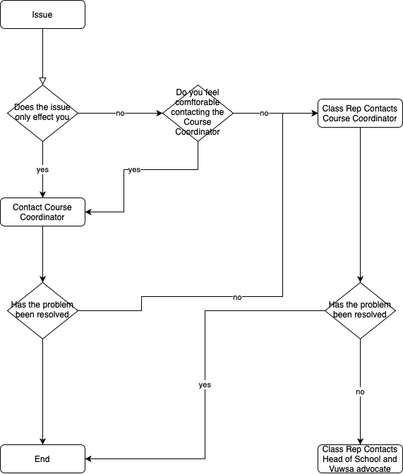

# Introduction

## Process
If there is an issue affecting you we have a handy flow chart to help you figure out what to do.

## Main policies
There are several key policies which effect students at Victoria University of Wellington. These policies are important for different reasons but make up the key policies which effect students at Victoria University of Wellington.
- [Student Conduct Statute](https://www.wgtn.ac.nz/documents/policy/student-policy/student-conduct-statute.pdf)
- [Assessment Handbook](https://www.wgtn.ac.nz/documents/policy/staff-policy/assessment-handbook.pdf)
- [Class Representation Policy](https://www.wgtn.ac.nz/documents/policy/academic/class-representative-policy.pdf)
- [Student Workload Policy](https://www.wgtn.ac.nz/documents/policy/student-policy/student-workload-policy.pdf)

### Grievance and Issue related policies
- [Academic Grievance Policy](https://www.wgtn.ac.nz/documents/policy/academic/academic-grievance-policy.pdf)
- [Academic Misconduct Procedure](https://www.wgtn.ac.nz/documents/policy/academic/academic-misconduct-procedure.pdf)
- [Sexual Harassment Response Policy](https://www.wgtn.ac.nz/documents/policy/staff-policy/sexual-harassment-response-procedures.pdf)
